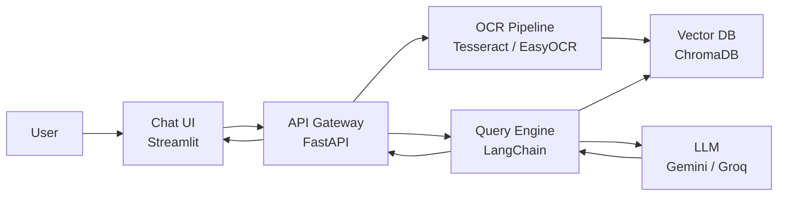

# Day 1 - AI System Architecture

## Muc tieu

Ve va giai thich duoc AI Chatbot System o muc container: UI, API, OCR, Vector DB, Query Engine, LLM.

## 1. System Architecture

### Dinh nghia

System Architecture mo ta cac thanh phan lon trong he thong, moi thanh phan lam gi, giao tiep voi nhau the nao, va du lieu di qua dau.

### Vi du

```text
User -> Chat UI -> API Gateway -> Query Engine -> LLM
              \-> OCR Pipeline -> Vector DB
```

## 2. C4 Container Model

### Dinh nghia

C4 Container Model la cach ve he thong o muc container. Container o day khong bat buoc la Docker container. No co the la web app, API service, database, worker, external service.

### Vi du container

| Container | Cong nghe | Trach nhiem |
| --- | --- | --- |
| Chat UI | Streamlit | Upload file, chat, hien citations |
| API Gateway | FastAPI | Nhan request, dieu phoi pipeline |
| OCR Pipeline | Tesseract/EasyOCR | Trich xuat text tu PDF/image |
| Vector DB | ChromaDB | Luu embeddings va metadata |
| Query Engine | LangChain | Retrieval, prompt building |
| LLM | Gemini/Groq | Sinh cau tra loi |

## 3. Data Flow

### Dinh nghia

Data Flow mo ta du lieu di qua cac buoc nao, input va output moi buoc la gi.

### Vi du upload document

```text
User upload file
-> Chat UI gui file len API
-> API luu file tam
-> OCR Pipeline trich text
-> Text duoc clean va chunk
-> Chunks duoc embed
-> Vector DB luu vectors + metadata
```

### Vi du hoi dap

```text
User ask question
-> API nhan question
-> Query Engine tim chunks lien quan trong Vector DB
-> Query Engine tao prompt voi context
-> LLM sinh answer
-> UI hien answer + citations
```

## 4. Architecture Diagram



## Bai tap

Tao file:

```text
ai_system_architecture.md
```

Yeu cau:

- Liet ke it nhat 6 container.
- Moi container co cong nghe va trach nhiem.
- Ve data flow cho upload document.
- Ve data flow cho Q&A.
- Ghi ro input/output cua OCR Pipeline.

## Checklist

- Giai thich duoc C4 Container Model.
- Phan biet duoc UI, API, pipeline, DB, LLM.
- Ve duoc flow upload document.
- Ve duoc flow hoi dap.
- Biet OCR nam o dau trong he thong.

