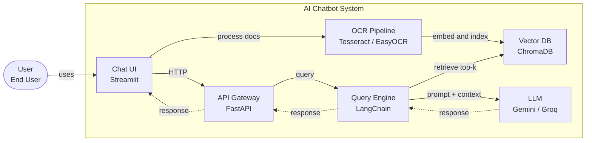

# AI Training Bootcamp Kickoff v3

Source PDF: `C:\Users\MANHPHAN2\Downloads\AI_Training_Bootcamp_Kickoff_v3.pdf`

## Phân tích nhanh

- Tài liệu là slide kickoff cho bootcamp AI kéo dài từ June 08, 2026 đến July 03, 2026.
- Mục tiêu chính: xây nền Python, xử lý OCR, hiểu và triển khai RAG, sau cùng demo chatbot AI chạy local.
- Lộ trình chia 4 tuần, mỗi tuần có một deliverable cụ thể để ép nhịp học theo sản phẩm thay vì chỉ học lý thuyết.
- Kiến trúc sản phẩm gồm Streamlit Chat UI, FastAPI API Gateway, OCR Pipeline, Vector DB, Query Engine bằng LangChain và LLM Gemini/Groq.
- Cách vận hành nhấn mạnh thực hành hằng ngày, demo mỗi thứ Sáu, dùng tài liệu dự án thật và push code lên GitHub cá nhân mỗi tuần.

## Kết quả cuối cùng

Upload document -> Auto OCR -> Smart Q&A -> Chat UI with citations.

## Metadata

| Field | Value |
| --- | --- |
| Course | AI Training Bootcamp |
| Topics | Python, OCR, AI, RAG, Chatbot |
| Timeline | June 08, 2026 - July 03, 2026 |
| Trainer | Dat Nguyen |

## Agenda

1. Why does this course matter?
2. Course objectives
3. Roadmap overview
4. AI System Architecture we will build
5. Tools & environment setup
6. Rules & commitments
7. Q&A

## Why Does This Course Matter?

| Real-world Context | Current Challenges | Opportunity |
| --- | --- | --- |
| AI is being integrated into most modern software projects. | No strong Python foundation to implement AI. | Master Python + RAG = build AI Chatbot for real projects. |
| Estimation projects require OCR, chatbot and document automation. | Do not know how to connect OCR -> AI -> complete product. | Confidently estimate and deliver AI-powered features. |

## Course Objectives

- Write Python to process data and call APIs confidently.
- Build an OCR pipeline to extract text from PDFs and images.
- Understand and implement a RAG system end-to-end.
- Demo a fully working AI Chatbot running locally.

Final deliverable: Upload document -> Auto OCR -> Smart Q&A -> Chat UI with citations.

## Roadmap Overview

| Week | Focus | Deliverable |
| --- | --- | --- |
| Week 1 | Python Foundation | Data processing script + API calls |
| Week 2 | AI Architecture + OCR | SA diagram + OCR pipeline |
| Week 3 | LLM & RAG System | RAG Chatbot Q&A from documents |
| Week 4 | Build & Demo Chatbot | Complete local AI Chatbot |

Each week: 7 days, 2-3 hours/day, 1 concrete deliverable.

## Week 1: Python Foundation

Goal: Write data processing scripts confidently.

| Day | Topic | Content |
| --- | --- | --- |
| Day 1-2 | Syntax & Data Types | Variables, lists, dicts, functions, loops, lambda |
| Day 3 | OOP & Modules | Classes, inheritance, error handling, imports |
| Day 4-5 | File & Data Handling | Read/write CSV/JSON, Pandas basics, Regex |
| Day 6-7 | API & Environment | pip, venv, requests, python-dotenv, mini project |

Deliverable: Automated script: read CSV -> process -> call API -> export report.

## Week 2: AI Architecture + OCR

Goal: Understand the full system before diving into details.

| Day | Topic | Content |
| --- | --- | --- |
| Day 1 | SA Session | Draw AI System Architecture: full pipeline, components, technology mapping |
| Day 2-3 | Basic OCR | Tesseract, pytesseract, EasyOCR, multi-language support |
| Day 4 | Image Preprocessing | Grayscale, threshold, deskew, denoise for better accuracy |
| Day 5-6 | PDF Processing | pdfplumber, pdf2image, PyMuPDF, extract tables from PDF |
| Day 7 | Cloud OCR & Chunking | Google Vision API / EasyOCR advanced, clean and chunk text output |

Deliverable: Clear SA diagram + OCR pipeline processing real documents.

## Week 3: LLM & RAG System

Goal: RAG chatbot that answers questions from real documents.

| Day | Topic | Content |
| --- | --- | --- |
| Day 1-2 | LLM & Prompt Engineering | Gemini/Groq API, system prompt, few-shot, chain-of-thought |
| Day 3 | Embeddings & Vector DB | text-embedding, ChromaDB / FAISS, cosine similarity |
| Day 4-5 | RAG Pipeline | Chunking -> Indexing -> Retrieval -> Generate answer |
| Day 6-7 | LangChain & Evaluation | Chains, reranking, metadata filtering, evaluate with RAGAS |

Deliverable: Chatbot receives question -> finds context in documents -> answers accurately.

## Week 4: Build & Demo AI Chatbot

Goal: Demo a complete AI Chatbot running locally.

| Day | Topic | Content |
| --- | --- | --- |
| Day 1-2 | FastAPI Backend | Upload file -> OCR -> RAG pipeline, async processing, error handling |
| Day 3-4 | Streamlit Chat UI | Chat interface, citations display, conversation history |
| Day 5-6 | Optimize & Testing | Embedding cache, batch processing, pytest unit tests |
| Day 7 | Local Demo | End-to-end demo run locally, record video walkthrough |

Deliverable: Upload document -> OCR -> RAG Q&A -> Complete Chat UI running locally.

## AI System Architecture

C4 Container Model for the AI Chatbot System.

Legend:

- Solid line: sync call.
- Dashed line: async / response.

## Tools & Environment

### Machine

- Python 3.11+
- VS Code
- Git

### Main Libraries

- pandas
- pytesseract
- EasyOCR
- pdfplumber
- langchain
- chromadb
- google-generativeai
- fastapi
- streamlit

### API Keys

| API | Notes | URL |
| --- | --- | --- |
| Gemini API Key | Free, 1M tokens/day | `aistudio.google.com` |
| Groq API Key | Free, large limit, ultra-fast | `console.groq.com` |

### GitHub

- Each member creates their own repo.
- Add `datnq-bnk` as Collaborator.
- Push code every week.

## Rules & Commitments

### Time Commitment

- Minimum 2-3 hours/day.

### Weekly Demo

- Every Friday: 2:00 PM - 3:30 PM.
- Full team demos the week's deliverable.
- Each member demos from their personal repo.

### Learning Principles

- Read and study fundamentals on official docs first.
- Apply knowledge into hands-on practice immediately.
- Use real project documents for practice.
- Each week must have a concrete deliverable.

### Discussion & Q&A

- Post issues, questions and discussions in group chat.

### Submit

- Push code to personal GitHub repo at the end of each week.

## Q&A

Any questions before we begin?
